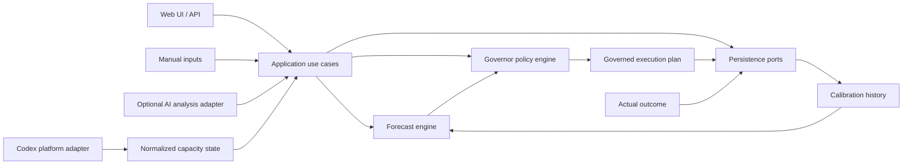

# Architecture context

## Purpose

Codex Capacity Governor plans finite AI coding capacity before work begins. It combines a planning forecast with a deterministic policy decision, then records actual results so forecasts can be calibrated over time.

The architecture must make policy decisions explainable and testable without requiring an AI model, a particular web framework, a database, or access to a coding platform's private account data.

## Architectural approach

Start as a modular monolith in a TypeScript monorepo. A single web deployment keeps the MVP operationally simple, while package boundaries preserve the option to extract components later. Do not create distributed services until measured scale or organizational needs justify them.

Dependency direction points inward: UI, databases, AI providers, and platform integrations depend on application and core contracts. Core packages do not import framework or infrastructure code.

## Proposed technology stack

| Concern | Proposal | Reason |
| --- | --- | --- |
| Workspace | pnpm monorepo | Fast, conventional workspace management with explicit package boundaries. |
| Language | TypeScript | Shared types across browser, server, contracts, and deterministic engines. |
| Web | Next.js + React | Familiar full-stack web foundation with a broad contributor pool. |
| Boundary validation | Zod | Runtime validation and inferred TypeScript types at transport/process boundaries. |
| Persistence | PostgreSQL + Drizzle ORM | Portable relational storage, reviewable SQL migrations, and lightweight typed access. |
| Unit/component tests | Vitest + Testing Library | Fast feedback for pure engines and UI behavior. |
| Browser tests | Playwright | Critical-path verification of the complete preflight loop. |
| AI analysis | Optional adapter using documented provider APIs | Keeps classification replaceable and permits a fully manual path. |
| Deployment | Container-compatible Node application | Avoids a required hosting vendor; a managed Node host and PostgreSQL may be selected later. |

Do not add a queue, event bus, vector database, microservice split, or generalized plugin framework for the MVP without a demonstrated requirement.

## Logical modules

### Contracts

Owns transport-neutral concepts such as project, tranche, normalized budget, task assessment, forecast range, governed plan, outcome, and calibration observation. Contracts must not contain React, ORM, HTTP, or provider SDK types.

The initial file in `packages/contracts/src/index.ts` is a draft vocabulary, not a finalized public API. Runtime schemas should be added alongside it when the application is bootstrapped.

### Forecast engine

Produces low, expected, and high planning estimates plus confidence and explanatory factors. It consumes normalized project/tranche data and historical calibration observations. Forecasts are ranges, never guarantees.

Forecast logic must be deterministic for the same input and configuration. AI may propose task classification inputs but must not silently replace forecasting or calibration rules.

### Governor policy engine

Consumes normalized budget state, a forecast, reserve requirements, reset context, and policy configuration. It returns exactly one primary decision—`PROCEED`, `NARROW`, `DEFER`, or `STOP / PRESERVE`—plus an operating mode, allocations, reasons, guidance, and stop conditions.

This is founder-owned domain logic. Keep it as pure functions with injected, versioned policy configuration. Do not encode thresholds until the founder approves the budget unit, comparison rules, reserve rules, and reset behavior.

### Application layer

Coordinates use cases such as creating a project, drafting a preflight, requesting analysis, generating a plan, recording an outcome, and viewing forecast-versus-actual history. It owns transactions and authorization decisions but not domain formulas.

### Persistence

Implements repositories behind application ports. Store the inputs and the version of forecast and policy configuration used to produce each plan. Treat outcomes as append-oriented evidence; corrections should preserve prior values or an audit trail.

Likely MVP records are:

- `Project`
- `Tranche`
- `Preflight`
- `TaskAssessment`
- `Forecast`
- `GovernedPlan`
- `ExecutionOutcome`
- `CalibrationObservation`

The exact relational schema remains part of the first collaborator proposal and requires review before migration files are accepted.

### AI analysis adapter

Optionally converts a brief into proposed task decomposition, complexity, risk, dependencies, and uncertainty. Its output is untrusted structured input that users can review and edit. The manual path must reach the same application contract.

Only official, documented APIs may be used. Do not access OpenAI authentication cookies, private balances, or undocumented Codex endpoints.

### Platform adapters

Convert provider-specific capacity data into a normalized budget state. The MVP must support a manual Codex adapter. Any later documented Codex integration lives behind the same port. The normalized contract must not assume all platforms expose identical units or reset behavior.

Claude Code is deliberately outside the first stable MVP.

## Data and audit requirements

- Store raw user-entered values separately from normalized values when conversion occurs.
- Record the forecast version, policy version, and relevant configuration with every governed plan.
- Preserve low/expected/high estimates and the actual outcome; do not retain only the error delta.
- Record corrections, failures, validation results, and deferred work, including negative results.
- Explanations must identify which deterministic rules led to a policy result.
- Sensitive product briefs and repository metadata require an explicit retention and deletion policy before external pilots.

## Invariants to protect

1. Implementation affordability never ignores required correction and validation reserve.
2. AI output cannot directly authorize work; deterministic policy makes the final decision.
3. Every governed plan has one primary policy decision and one operating mode.
4. Forecast and policy versions are recoverable from stored history.
5. Manual entry works without a platform integration or AI provider.
6. Core packages remain independent of UI, storage, and provider SDKs.

## Scaffold boundary

This setup establishes documentation, directory ownership, and a draft contract vocabulary only. It intentionally does not add:

- a Next.js application or UI;
- database schemas or migrations;
- forecast formulas or calibration weights;
- Governor thresholds or reserve calculations;
- AI calls or provider credentials;
- Codex balance automation;
- execution integration, billing, authentication, or deployment;
- Claude Code support.

## Decisions requiring founder approval

Before policy implementation begins, the founder must approve:

1. **Budget semantics:** supported manual units, normalization rules, precision, and whether different units may be compared.
2. **Policy thresholds:** exact transitions among modes and decisions, including precedence and boundary behavior.
3. **Reserve rules:** fixed versus proportional correction/validation reserves, minimums, overrides, and rounding.
4. **Reset behavior:** when reset timing permits `DEFER`, and how uncertain or rolling reset windows are represented.
5. **Forecast method:** initial complexity/risk taxonomy, range calculation, confidence scale, and cold-start defaults.
6. **Outcome semantics:** what counts as implementation, correction, validation, failure, and deferred work.
7. **Pilot data:** authentication, tenancy, retention, deletion, privacy, and whether briefs may be sent to an AI provider.
8. **Deployment target:** local-only pilot versus hosted pilot and the selected managed PostgreSQL provider, if any.

Use short architecture decision records in `docs/decisions/` once these choices are approved.
